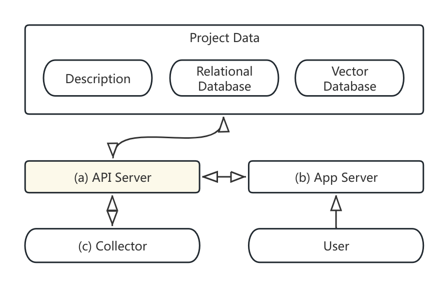

Pinhole (洞见)
===============

Pinhole是一个开源的，基于大模型进行学术和产业界技术洞察，以协助我们寻找技术演进方向的项目。我们开发该项目的核心目的是减少在这方面大量无序的重复工作。

我们基于Pinhole对感兴趣的业界和学术界信息进行收集和整理，并搭建了同名网站 [Pinhole](https://pinhole.uv0xab.com/), 欢迎访问。

<div align="center">
    
    <br />
    <p>本logo由智谱AI开放平台模型 <i>cogview-3</i> 生成
</div>


## 整体架构

*Pinhole* 工具的主体由 *API Server*, *App Server* 和 *Collector* 三部分组成。各组件之间的交互关系如下图所示。

<div align="center">
    
</div>

- **API Server** 是一个基于`FastAPI`实现的服务器，它仅监听来自localhost的请求，负责整个数据库的管理工作，包括对文档(Document), 总结(Summary)等的创建，删除，列表等；
- **App Server** 是一个基于`streamlit`的前段服务器，负责为用户提供网页服务，它的数据来源均通过向*API Server*的请求来获取，*App Server*自身不存储任何数据。因此在需要的情况下，这两个服务器可以很容易地扩展为分布式部署，并引入负载均衡机制（当然现在并没有实现）;
- **Collector** 是一个信息收集任务而不是常驻的服务器。它包含一系列爬虫用来收集我们感兴趣的学术界和业界资讯。除此之外，它还负责调用大模型服务并生成文档的总结。*Collector* 也不直接接触数据库，它同样通过http请求来调用由 *API Server* 提供的数据管理服务。

## 快速上手

### 1.安装`pinhole`

`pinhole`是一个python安装包，因此可以很容易地使用pip来安装：

```shell
git clone https://gitee.com/liyifm/pinhole.git
python3 -m pip install -e ./pinhole

# python3 -m pinhole 是整个工程的运行入口脚本
python3 -m pinhole --help
```

### 2. 运行 *API Server*

运行apiserver需要指定一个工程目录，该目录中应当包含`project.json`。如果没有包含，apiserver会自动创建一个空的工程文件。在仓库中我们提供了一个小型的样例工程。

```shell
python3 -m pinhole apiserver ./pinhole/examples/project0
```

### 3. 运行 *App Server*
打开一个新的终端标签页，或者在`tmux`等窗口管理器中打开新窗口，运行如下命令：
```shell
python3 -m pinhole appserver
```

在第一次运行基于`streamlit`的应用时，会提示用户输入邮件，留空即可。默认该应用会在8080端口启动，根据屏幕上的提示访问本地8080端口网站即可打开。